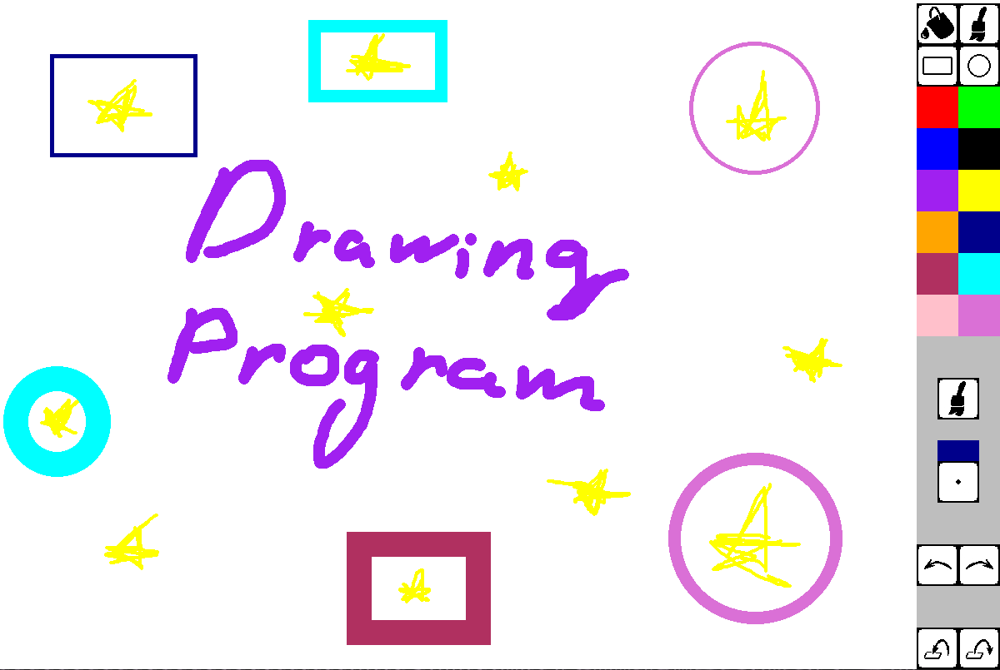

# 🎨 Drawing Program (Pygame) / Программа для рисования (Pygame)



Простое приложение для рисования с интуитивным интерфейсом и стандартными инструментами.

---

## 📥 Скачать

> **Готовая сборка для Windows:**  
> [DrawingProgram.exe](https://drive.google.com/file/d/1fBD4YIJSJlXW4jMX3KwC6pAuLs09_0Xv/view?usp=drive_link) *(Windows 10/11)*

---

## 🚀 Возможности
- Рисование кистью разных размеров  
- Ластик  
- Заливка цветом  
- Действие назад/вперёд на 1 шаг  
- Сохранение (PNG) и загрузка изображений (PNG, JPG)

---

## 🛠 Для разработчиков

### 1. Клонирование репозитория
```bash
git clone https://github.com/kondak12/drawing-program.git
cd drawing-program
```

### 2. Установка зависимостей
```bash
pip install -r requirements.txt
```
